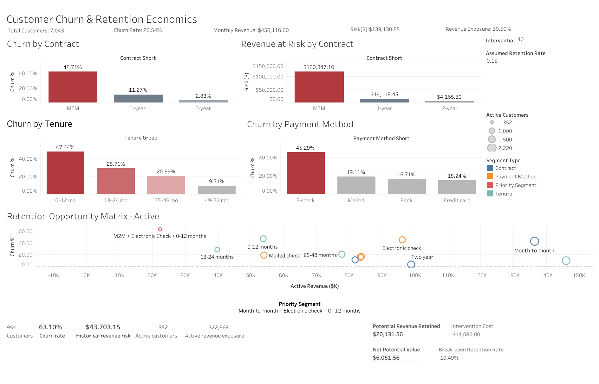

# Customer Churn & Retention Economics — Telecom Subscription Business

## Business Problem

Customer attrition reduces recurring revenue in subscription businesses. This project analyzes customer-level telecom subscription, billing, contract, payment, and service data to identify where churn is concentrated, quantify revenue exposure, and identify retention opportunities.

## Dashboard

### Dashboard Preview



The Tableau dashboard brings together:

- Churn and revenue KPIs
- Contract, tenure, and payment segmentation
- Historical revenue-at-risk analysis
- Retention Opportunity Matrix
- Priority segment analysis
- Illustrative retention economics

**Interactive Tableau Dashboard:**  

[View the dashboard on Tableau Public](https://public.tableau.com/views/CustomerChurnRetentionEconomics-Telecom/CustomerChurnRetentionEconomics)

## Objective

The objective is to combine SQL-based customer analysis, statistical analysis, Python, and dashboarding to:

- Measure customer churn and revenue exposure
- Identify customer segments associated with higher churn
- Quantify revenue associated with churn
- Identify concentrated retention opportunities
- Evaluate illustrative retention intervention economics
- Translate findings into targeted, testable business recommendations

## Key Questions

1. How large is customer churn?
2. Which customer segments show elevated churn?
3. Where is revenue exposure concentrated?
4. Which customer population should be considered for targeted retention testing?
5. What retention improvement would make an intervention economically viable?

## Tools & Technologies

- PostgreSQL / SQL
- Python
- Pandas
- SciPy
- Statsmodels
- Tableau
- Git & GitHub

## Dataset

The analysis uses the IBM Telco Customer Churn dataset containing 7,043 customer records and customer-level information covering demographics, tenure, contracts, payment methods, services, billing, and churn status.

## Analysis

### Business Metrics

- Customer count
- Churn rate
- Monthly revenue
- Revenue at risk
- Revenue exposure %

### Segmentation Analysis

The analysis examines churn across:

- Contract type
- Tenure
- Monthly charges
- Payment method
- Service breadth
- Contract × payment method
- Contract × tenure

### Statistical Analysis

Chi-square tests and Cramér's V were used to assess associations between categorical customer attributes and churn.

A multivariable logistic regression was also used to examine the association between selected customer characteristics and churn while controlling for other included variables.

## Key Findings

### Overall Churn

- Total customers: **7,043**
- Churned customers: **1,869**
- Churn rate: **26.54%**
- Monthly revenue: **$456,116.60**
- Historical monthly revenue associated with churn: **$139,130.85**
- Revenue exposure: **30.50%**

### Contract

Month-to-month customers show substantially higher observed churn than customers on longer-term contracts.

### Tenure

Customers within their first 12 months show the highest observed churn among the tenure groups analyzed.

### Payment Method

Electronic-check customers show elevated observed churn and substantial revenue exposure.

### Priority Segment

The intersection of:

**Month-to-month + Electronic Check + 0–12 Months**

contains:

- 954 customers
- 602 historically churned customers
- **63.10% observed churn**
- **$43,703.15 historical monthly revenue associated with churn**
- 352 currently active customers
- **$22,368.40 active monthly revenue exposure**

## Retention Opportunity

The project distinguishes between:

- **Historical revenue at risk:** monthly revenue associated with customers who have already churned.
- **Active revenue exposure:** monthly revenue currently associated with active customers within identified retention opportunity segments.

A Retention Opportunity Matrix combines observed churn rates with active monthly revenue exposure to identify segments that may warrant retention attention.

## Business Recommendations

### 1. Early-Tenure Retention

Test targeted early-tenure retention interventions such as structured onboarding, proactive check-ins, and targeted support or offers.

### 2. Contract & Payment Conversion

Test interventions that reduce payment friction and encourage movement from month-to-month plans toward longer-term arrangements where economically appropriate.

### Pilot Approach

The active **month-to-month + electronic-check + 0–12 month** population provides a focused population for initial retention testing.

Retention experiments should evaluate:

- Incremental retention
- Revenue retained
- Intervention cost
- Net incremental value

## Retention Economics

Illustrative six-month scenarios were used to calculate intervention break-even thresholds.

| Intervention Cost / Customer | Break-even Retention |
|---:|---:|
| $20 | 5.24% |
| $40 | 10.49% |
| $60 | 15.73% |

These scenarios are decision thresholds rather than forecasts of actual intervention performance.

## Project Structure

```text
telco_churn/

├── data/
│   ├── raw/
│   └── cleaned/

├── sql/

├── analysis/

├── dashboard/

├── documentation/

├── retention_opportunity_matrix.csv

├── README.md

└── .gitignore
```

## Limitations

This dataset is an observational customer snapshot. The analysis identifies associations with observed churn and does not establish causation.

Historical revenue-at-risk figures represent monthly revenue associated with customers who churned in the observed dataset rather than guaranteed future revenue loss.

Actual A/B testing was not possible with the available historical snapshot because it does not contain treatment assignment, control/treatment groups, intervention timing, or post-intervention outcomes.

## Documentation

- [Business Recommendations](documentation/recommendations.md)
- [Retention Recommendation Memo](documentation/retention_recommendation_memo.md)
- [Methodology](documentation/methodology.md)
